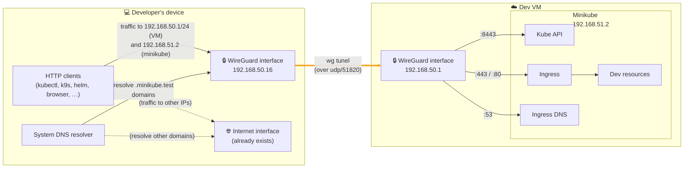

# NaaVRE development VM

## Overview

This repo contains configuration and documentation for a VM intended to run NaaVRE for development purposes. This allows developers to spend less time setting up a development environment on their own machines.

The VM runs the following services (see [creation](./SETUP.md#vm-creation) and [configuration](./SETUP.md#vm-configuration) instructions):
- a Minikube cluster (in docker and reachable at `192.168.51.2`), on which NaaVRE and additional services may be deployed
- a WireGuard VPN (listening on port `:51820`), used for access from the developer's device

The developer connects with their own device through WireGuard (see [configuration instructions](./SETUP.md#device-configuration)). They can:
- control the Minikube cluster with `kubectl`, `helm`, `k9s` and other kube API clients
- access the web services running on the cluster through a domain name and standard HTTP(s) ports (any domain ending in `.minikube.test`)

This is achieved by running Minikube addons [ingress](https://minikube.sigs.k8s.io/docs/tutorials/nginx_tcp_udp_ingress/) and [ingress-dns](https://minikube.sigs.k8s.io/docs/handbook/addons/ingress-dns/), and providing a WireGuard configuration for the developer's machine that:
- forwards DNS requests for `.minikube.test` domains to Minikube,
- route traffic to Minikube through the WireGuard tunel,
- leave other DNS requests and traffic go through the existing interface (so the VM never sees them).

## Set-up

- You are creating a VM for yourself or someone else: start at [VM setup](./SETUP.md#vm-creation).
- You received access to a bare VM and want to configure it: start at [VM configuration](./SETUP.md#vm-configuration).
- You received access to a pre-configured VM and want to configure your device to access it: follow [device configuration](./SETUP.md#device-configuration).

## Usage

See [USAGE.md](./USAGE.md).
