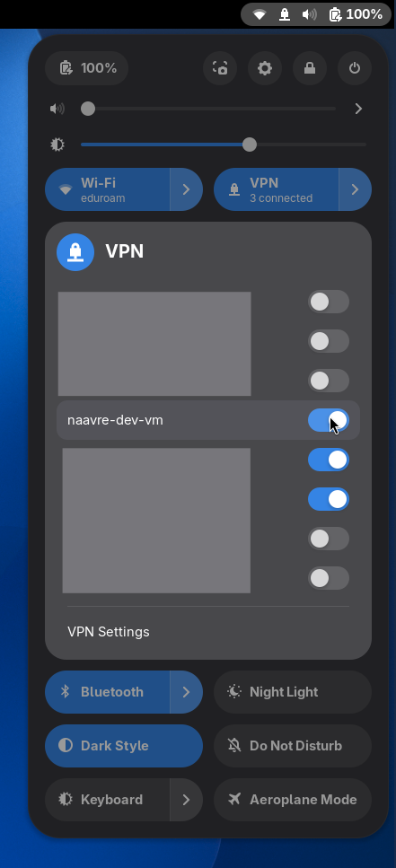

# Setting up the dev VM and access to it

## VM creation

This section is about creating a VM on the SNE OpenStack. Typically, this is done by a member of LifeWatch ERIC VLIC or of MNS. However, a VM with similar configuration from another provider should also work.

**Step 1** Create a VM on OpenStack. Configuration (others might work, but have not been tested):

- Recommended name: `naavre-dev-<user>-<n>` (example: `naavre-dev-sam-1`)
- Volume size: 200 GiB
- Source image: `Ubuntu 26.04`
- Flavor: `STD-04C008R` (4 vCPU, 8 GB RAM)
- Security group `naavre-dev-vm` (create it if needed, see details below) **Important:** remove the `default` security group.

<details>
<summary>Security group details</summary>

```
ALLOW IPv4 to 0.0.0.0/0
ALLOW IPv6 to ::/0
ALLOW IPv4 22/tcp from 0.0.0.0/0
ALLOW IPv4 51820/udp from 0.0.0.0/0
ALLOW IPv4 icmp from 0.0.0.0/0
```

</details>

After creation, the VM automatically applies updates and reboots. This usually takes 5 minutes.

The VM can be accessed with `ssh ubuntu@<IP>` using the SSH key configured in OpenStack, and the assigned IP.

**Step 2** Append the end user's SSH key to the authorized keys. (Skip if you are the end user.)

```console
you@your-device:~$ ssh ubuntu@<IP>
naavre-dev-sam-1:~$ echo "ssh-ed25519 ... sam@device" >> ~/.ssh/authorized_keys
```

## VM configuration

This step assumes a bare VM as a starting point. It installs and configures a Minikube cluster on the VM, and a WireGuard server to allow connecting to Minikube from another device.

**Step 1** Connect the VM through SSH first to accept the SSH fingerprint:

```console
you@your-device:~$ ssh ubuntu@<IP>
The authenticity of host '<IP> (<IP>)' can't be established.
ED25519 key fingerprint is: SHA256:...
This key is not known by any other names.
Are you sure you want to continue connecting (yes/no/[fingerprint])? yes
Warning: Permanently added '<IP>' (ED25519) to the list of known hosts.
...
ubuntu@naavre-dev-sam-1:~$
```

**Step 2** Clone this repository and install the dependencies:

```shell
git clone https://github.com/NaaVRE/NaaVRE-dev-vm
cd NaaVRE-dev-vm/ansible
virtualenv venv
source venv/bin/activate
pip install -r requirements.txt
source venv/bin/activate
ansible-galaxy collection install -r requirements.yml
```

**Step 3** Run the playbook

```shell
ansible-playbook site.yml -u ubuntu -i "<IP>," # <- don't forget the comma!
```

**Troubleshooting** If the ansible playbook fails, inspect its source and compare to the error message that you get. Opening a SSH session on the VM and running the failing action in bash might be useful (this might require converting statements from ansible modules to bash commands, e.g. a `ansible.builtin.ufw` becomes a `ufw` command).

**Step 4** Check that it works

Once the VM is configured, you should be able to perform the following actions from a terminal on the VM:

```console
# Ping the minikube container from the VM
ubuntu@naavre-dev-sam-1:~$ ping 192.168.51.2
PING 192.168.51.2 (192.168.51.2) 56(84) bytes of data.
64 bytes from 192.168.51.2: icmp_seq=1 ttl=64 time=0.180 ms

# Contact the kube API endpoint
ubuntu@naavre-dev-sam-1:~$ curl -kv https://192.168.51.2:8443
...
< HTTP/2 403
...
{
  "kind": "Status",
  "apiVersion": "v1",
  "metadata": {},
  "status": "Failure",
  "message": "forbidden: User \"system:anonymous\" cannot get path \"/\"",
  "reason": "Forbidden",
  "details": {},
  "code": 403
}

# Contact the ingress endpoint
ubuntu@naavre-dev-sam-1:~$ curl -kv https://192.168.51.2:443
...
< HTTP/2 404
...
<html>
<head><title>404 Not Found</title></head>
<body>
<center><h1>404 Not Found</h1></center>
<hr><center>nginx</center>
</body>
</html>

# Use kubectl
ubuntu@naavre-dev-sam-1:~$ minikube kubectl -- get node
NAME       STATUS   ROLES           AGE   VERSION
minikube   Ready    control-plane   10m   v1.37.0

# Resolve a domain through the minikube ingress-dns
ubuntu@naavre-dev-sam-1:~$ dig +noall +answer hello.minikube.test @192.168.51.2
hello.minikube.test.	300	IN	A	192.168.51.2
```

## Device configuration

### Connect through SSH

You should be able to connect with your SSH key without further configuration:

```shell
ssh ubuntu@<IP>
```

### Configure WireGuard

What this does to your device:
- Create a WireGuard connection to the VM
- Route traffic to `192.168.50.0/24` (wg network) and `192.168.51.2` (Minikube container) through WireGuard. Other traffic from your device is not routed through the VM.
- Tells your system to use the Minikube DNS to resolve domain names ending in `.minikube.test`. Other DNS requests are not sent to the VM.

**Step 1** Copy the WireGuard configuration file from the VM to your device:

   ```shell
   scp ubuntu@<IP>:naavre-dev-vm.conf .
   ```

**Step 2, Option A**: Use NetworkManager (recommended on Ubuntu and other GNU/Linux distributions using NetworkManager)

1. Import the configuration to NetworkManager:

   ```shell
   nmcli connection import type wireguard file naavre-dev-vm.conf
   ```

2. Activate the connection using the GUI or the terminal:

   

   ```shell
   nmcli con up naavre-dev-vm
   ```

**Step 2, Option B**: Use the dedicated WireGuard client for your system

1. Follow the [WireGuard installation instructions](https://www.wireguard.com/install/)
2. Import the configuration file, or activate the connection directly:
   - some systems offer a GUI to do so,
   - some offer `wg-quick`:

     ```shell
     sudo wg-quick up naavre-dev-vm.conf
     ```

**Step 3** Check that it works

Once WireGuard is configured, you should be able to:

```console
# Ping the VM through WireGuard
you@your-device:~$ ping 192.168.50.1
PING 192.168.50.1 (192.168.50.1) 56(84) bytes of data.
64 bytes from 192.168.50.1: icmp_seq=1 ttl=64 time=7.51 ms
...

# Ping the minikube container
you@your-device:~$ ping 192.168.51.2
PING 192.168.51.2 (192.168.51.2) 56(84) bytes of data.
64 bytes from 192.168.51.2: icmp_seq=1 ttl=63 time=6.61 ms
...

# Contact the kube API endpoint
you@your-device:~$ curl -kv https://192.168.51.2:8443
...
< HTTP/2 403
...
{
  "kind": "Status",
  "apiVersion": "v1",
  "metadata": {},
  "status": "Failure",
  "message": "forbidden: User \"system:anonymous\" cannot get path \"/\"",
  "reason": "Forbidden",
  "details": {},
  "code": 403
}

# Contact the ingress endpoint
you@your-device:~$ curl -kv https://192.168.51.2:443
...
< HTTP/2 404
...
<html>
<head><title>404 Not Found</title></head>
<body>
<center><h1>404 Not Found</h1></center>
<hr><center>nginx</center>
</body>
</html>
```

### Configure kubectl and helm

**Step 1**: install on your device:

- kubectl ([documentation](https://kubernetes.io/docs/tasks/tools/#kubectl))
- helm ([documentation](https://helm.sh/docs/intro/install/))
- (optional) k9s ([documentation](https://k9scli.io/topics/install/)), 

**Step 2**: retrieve the kubeconfig from the VM:

```shell
mkdir .kube/
scp ubuntu@<IP>:config_naavre-dev-vm.yaml .kube/
```

**Step 3 Option A**: overwrite the existing kubeconfig (use this if you have no existing files in `~/.kube` that you want to keep)

```shell
mv ~/.kube/config_naavre-dev-vm.yaml ~/.kube/config # <- WARNING: this will delete your kubeconfig. To preserve it, use Option B
```

**Step 3 Option B**: merge the kubeconfig with the existing one:

```shell
cp --backup=numbered ~/.kube/config ~/.kube/config.bak
KUBECONFIG="$HOME/.kube/config:$HOME/.kube/config_naavre-dev-vm.yaml" \
  kubectl config view --flatten > /tmp/kubeconfig_merged.yaml \
  && mv /tmp/kubeconfig_merged.yaml ~/.kube/config
```

**Step 4**: verify that it works

You should be able to run kubectl on your device:

```console
you@your-device:~$ kubectl --context minikube get node
NAME       STATUS   ROLES           AGE    VERSION
minikube   Ready    control-plane   118m   v1.37.0
```

### Configure access to services deployed on Minikube

To access a NaaVRE deployment on Minikube, services must be accessed through a domain name (we use `naavre-dev.minikube.net`) from your device. This should work out of the box if you have configured the WireGuard access.

**Verify that it works:**

- Open your browser at https://hello.minikube.test/
- Add a security exception for the self-signed SSL certificate (your browser will warn you about it)
- You should see “It works!”

**Troubleshooting:** if the above doesn't work:

- Check that you can resolve a domain through the minikube ingress-dns from your device?
  ```console
  # Resolve a domain through the minikube ingress-dns
  you@your-device:~$ dig +noall +answer hello.minikube.test @192.168.51.2
  hello.minikube.test.	300	IN	A	192.168.51.2
  ```
  If it fails: check your wireguard setup, and that Minikube is running correctly (see the “check that it works” in the respective sections).

- Check that you can resolve a domain using your system's default resolver
  ```console
  # Resolve a domain through the minikube ingress-dns
  you@your-device:~$ dig +noall +answer hello.minikube.test
  hello.minikube.test.	242	IN	A	192.168.51.2
  ```
  If it fails while the previous check succeeds: your device is not honoring the WireGuard DNS configuration. As a workaround, add the domains that you need to `/etc/hosts` on your device (or equivalent):

  ```
  # /etc/hosts on your device
  192.168.51.2 hello.minikube.test
  192.168.51.2 naavre-dev.minikube.test
  192.168.51.2 s3.naavre-dev.minikube.test
  ```

- Check if you can reach the test deployment through its domain name
  ```console
  you@your-device:~$ curl -kv https://hello.minikube.test
  ...
  < HTTP/2 200
  ...
  <html>
  <head><title>It works!</title></head>
  <body>
    <h1>It works!</h1>
    <p>If you can read this, your device can access services running on Minikube through their domain names.</p>
  </body>
  </html>
  ```
  - If this fails while the previous check succeeds: check that everything is running correctly on Minikube. The test deployment (`hello`) is likely not working.
